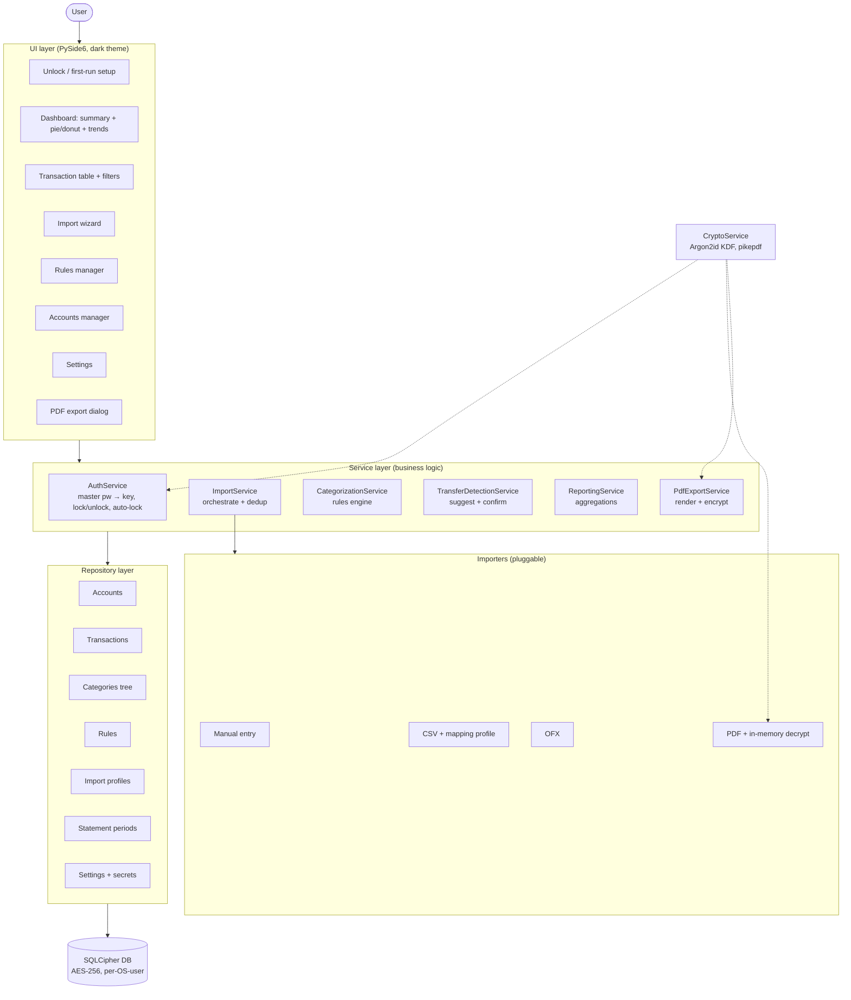

# finbreak — Design (Phase B)

> **Status:** Approved 2026-06-30.
> **Phase:** B — Design.
> **Output:** architecture diagram, components, data flow,
> cross-cutting concerns, ADRs in `docs/decisions/`.
> **Gate:** user explicitly approves this document and the
> ADRs before Phase C starts.
> **Source of truth for:** *what is*. ADRs are *why we chose
> this*; specs are *contract for one item*.

## Architecture

A layered desktop app. The UI never touches storage directly — everything goes
through a service layer, which goes through repositories, which own the only
handle to the encrypted database. This keeps each layer testable in isolation
(services tested with an in-memory repo; importers tested with sample files).

## Components

One main responsibility per box.

**UI layer (PySide6)** — presents state and captures input; holds no business
logic. Notable screens:

- **Unlock / first-run** — prompts for the master password; on first run, sets
  it and the base currency. Main responsibility: gate access to the data.
- **Dashboard** — income-vs-expenditure summary, category pie/donut, and
  month-to-month trends, for a chosen period and account (or all accounts).
- **Transaction table** — searchable, filterable list; the screen where a user
  re-categorises a transaction or confirms a transfer.
- **Import wizard** — pick file(s) → choose/define a mapping profile (CSV) →
  preview → confirm; prompts for a PDF password when needed.
- **Rules manager** — view/add/edit auto-categorisation rules.
- **Accounts manager** — add/edit accounts and their type (current, savings,
  credit card, personal loan, home loan, investment, other).
- **Category manager** — add/edit/delete categories under the two fixed types
  (Income / Expenditure); the tree is stored self-referentially to hold a
  future sub-category level (FIBR-0006).
- **Settings** — base currency, auto-lock timeout, stored PDF passwords, backup
  export, theme.
- **PDF export dialog** — tick sections (summary / charts / transactions), pick
  period, set the export password.

> **Deferred decision — charts library.** discovery.md flagged the charts
> library (QtCharts vs matplotlib vs pyqtgraph) as a "design-phase decision";
> the design phase intentionally **re-defers** it to the dashboard spec
> (FIBR-0012), where it is chosen and recorded as an ADR (must be
> dark-themeable *and* render into the PDF). The decision only bites when the
> dashboard is built, so it lives with that phase — this is a hand-off, not a
> dropped thread.

**Service layer** — the business logic; one service per concern:

- **AuthService** — turns the master password into the DB key (via
  CryptoService), unlocks/locks the database, runs the inactivity auto-lock.
  Main responsibility: control access to decrypted data.
- **ImportService** — orchestrates an import: select importer by file type →
  normalise rows to transaction drafts → **de-duplicate** against existing →
  persist → trigger categorisation and transfer detection. Main
  responsibility: get external data in, exactly once.
- **CategorizationService** — applies the rule set to assign categories;
  records manual overrides as the highest-priority signal. Main
  responsibility: classify each transaction.
- **TransferDetectionService** — finds debit/credit pairs across the user's own
  accounts and proposes them as transfers for the user to confirm. Main
  responsibility: identify internal money movement so it can be excluded.
- **ReportingService** — aggregates transactions by category, account, and
  period into the numbers the dashboard and PDF need. Main responsibility:
  turn rows into breakdowns.
- **PdfExportService** — renders the chosen sections to PDF (Qt engine), then
  encrypts with a password (pikepdf). Main responsibility: produce the locked
  shareable report.
- **CryptoService** — Argon2id key derivation, secret handling, and pikepdf
  encrypt/decrypt. Main responsibility: own all cryptographic operations in one
  auditable place.

**Importers (pluggable)** — `ManualEntry`, `CsvImporter` (+ mapping profile),
`OfxImporter`, `PdfImporter` (decrypts in memory first). Each exposes the same
interface: `parse(source) -> ParseResult` — the transaction drafts plus any
per-row parse errors and the statement's coverage period (start/end). Adding a
new format = adding one importer; nothing else changes. (CSV is the first
implementor — see FIBR-0007.)

**Repository layer** — the only code that touches SQL. One repository per
aggregate (Accounts, Transactions, Categories, Rules, Import profiles, Statement
periods, Settings & secrets). Main responsibility: persistence, nothing else.

**Storage** — a single SQLCipher database file in the per-OS-user data
directory (resolved via `QStandardPaths.AppDataLocation`). AES-256, whole-file
encrypted.

## Data flow

**Dominant path — import to insight:**

1. User unlocks → AuthService derives the key → repositories open the DB.
2. User runs the import wizard and picks a statement file for an account.
3. ImportService selects the importer (by extension/content); a PDF that's
   locked is decrypted in memory first (prompting for / reusing its password).
4. The importer returns normalised drafts (date, amount, description — the
   sign carried in the signed amount — plus the source row number).
5. ImportService **de-duplicates** drafts against existing transactions (match
   on account + date + amount + normalised description; the indexed hash is
   FIBR-0026) → only genuinely new rows are persisted.
6. CategorizationService auto-tags the new rows via the rule set.
7. TransferDetectionService scans for cross-account debit/credit matches and
   raises **suggestions**.
8. The UI shows new transactions and any transfer suggestions; the user
   confirms transfers and corrects categories (manual overrides win).
9. ReportingService recomputes; the Dashboard re-renders (charts, summary,
   trends).

**Export path:** user opens the export dialog → picks period + sections + a
password → PdfExportService renders via the Qt PDF engine → CryptoService/pikepdf
encrypts → a password-locked PDF is written to a user-chosen location.

**Feedback loop:** any edit (manual category, confirmed/rejected transfer, new
rule) writes through a repository and emits a Qt signal; subscribed views
(dashboard, table) refresh. State changes flow one way: UI → service → repo →
signal → UI.

## Cross-cutting concerns

### Security (the load-bearing concern — this is personal financial data)

The full threat model — assets, trust boundaries, the STRIDE-lite threat
table, and the enforceable security invariants (§ 5) — lives in the canonical
[docs/security-model.md](security-model.md). The summary below is the
architecture-level view; `security-model.md` is authoritative, and every
`implement`-Kind item must satisfy its invariants.

- **Encryption at rest.** The entire database is SQLCipher (AES-256). The file
  is meaningless without the key.
- **Key derivation.** The master password is stretched with **Argon2id**
  (memory-hard) into the DB key. The password and derived key are never
  persisted; the key lives in memory only while unlocked and is cleared on lock.
- **No network, ever.** The app opens no sockets, bundles no networking client,
  and makes no outbound calls. (Dependabot/CI run in GitHub's infrastructure,
  not in the shipped app.)
- **Per-OS-user isolation.** Data lives in the current OS user's app-data
  directory; different logins are naturally separate, each behind its own master
  password.
- **Secrets in the vault.** Optional stored PDF passwords live *inside* the
  encrypted DB — never in plaintext, never outside the vault.
- **Input PDFs decrypted in memory only.** A locked statement is never written
  decrypted to disk.
- **Auto-lock.** After a configurable idle period the key is dropped and the UI
  returns to the unlock screen.
- **No recovery backdoor.** A forgotten master password means unrecoverable
  data (by design). Mitigation: an explicit **encrypted backup export** the user
  can store safely.

### Error handling

Errors surface to the user; nothing is silently swallowed (per coding
standards). Import parse errors are shown per-row in the wizard preview *before*
anything is written — the user sees "12 of 240 rows couldn't be parsed" and can
proceed with the good rows or fix the mapping. Storage/crypto failures raise a
clear dialog (e.g. "wrong password"). A wrong PDF password re-prompts rather
than aborting the whole import.

### Observability

A local **rotating log file** in the user data directory (no telemetry, no
network). Logs record operations and errors but **never** transaction contents
or secrets. The log path is shown in Settings so a user can find it for
support.

### State management

One unlocked DB connection per session, owned by the repository layer. Views are
stateless renderers subscribed to repository signals. There is no global mutable
store beyond the DB; "current period" and "current account filter" are view-local
UI state.

### Persistence

- **Location:** `QStandardPaths.AppDataLocation` → `~/.local/share/finbreak/`
  (Linux), `%APPDATA%\finbreak\` (Windows), `~/Library/Application Support/finbreak/`
  (macOS). The name is `finbreak` everywhere — brand, repo, data
  directory, and Python package — set via `QCoreApplication.setApplicationName("finbreak")`.
- **Schema & migrations:** a `schema_version` table; migrations run on both
  vault creation and unlock, forward-only, each in a transaction.
- **Atomicity:** every import/edit is a single DB transaction — a failed import
  leaves no partial rows.
- **Tables (high-level):** `accounts`, `transactions`, `categories` (self-
  referential tree, `parent_id`), `rules`, `transfer_links` (links a confirmed
  transfer pair — success criterion 3), `import_profiles`, `statement_periods`
  (a statement's coverage period per import — success criterion for FIBR-0038),
  `secrets` (the opt-in stored PDF passwords — asset A4 in security-model.md),
  `settings`, `schema_version`. Exact columns are fixed in each item's spec.

### Concurrency

CSV parsing/import runs on the GUI thread in v1 — personal statements parse well
within a frame budget, so a worker thread is deferred until a large-file jank is
actually measured (FIBR-0007 D11). Moving parsing/import to a worker thread
(`QThread`) is the planned enhancement when that day comes. DB writes are
serialised through the repository layer.

### Internationalization (i18n) & localisation

The UI is built **translation-ready and layout-mirror-ready from the first
screen (P02)**, not retrofitted. Wrapping strings and keeping layouts
direction-agnostic while a screen is written costs almost nothing; retrofitting
i18n and right-to-left (RTL) support across a feature-complete UI is a
whole-codebase rewrite. So, as a standing convention:

- **Every user-facing string goes through Qt's translation system** —
  `tr()` / `QCoreApplication.translate()`. No display literal is hardcoded, and
  strings are never assembled by `+` / f-string concatenation (word order
  varies by language); values are substituted through placeholders after
  translation instead. The exact PySide6 idioms live in coding.md § 5.2.
- **Layouts are direction-agnostic so the whole UI mirrors for RTL locales.**
  Screens are arranged with Qt layout managers rather than fixed positions, so
  they flip automatically with the application's `layoutDirection`, and text
  keeps its direction-aware default instead of forced left/right alignment.
  Direction-implying icons (back / forward arrows) are the one thing Qt won't
  flip on its own, so they are mirrored explicitly (the concrete rule is in
  coding.md § 5.2). This works **only** when the UI avoids hardcoded left/right
  absolutes — hence the from-P02 discipline:
  building it this way once means only the first RTL locale added (Arabic) needs
  layout QA, and further RTL scripts (Hebrew, Urdu) are then translation-only.
- **Numbers, currency, and dates are formatted through `QLocale`**, never
  hand-rolled format strings. This is not cosmetic for a finance app: decimal
  and thousands separators and date conventions differ per locale, so figures
  read naturally in every locale while still showing the user's chosen base
  currency.
- **Translations load at runtime** via `QTranslator` (compiled `.qm`
  catalogs), switchable at runtime from the language picker FIBR-0017 adds to
  the FIBR-0014 Settings screen — no reinstall; selecting an RTL locale flips
  the layout direction app-wide. Live switching relies on the per-widget
  re-translation coding.md § 5.2 requires (it is not automatic); otherwise a
  change applies on next launch.
- **Non-display** strings — log messages, DB keys, enum values — are *not*
  translated; only what the user reads on screen.

Shipping the catalogs themselves is the **FIBR-0017** (P12) deliverable — the
initial set is English (base), Spanish, Simplified Chinese, Hindi, French, and
**Arabic**; the packaging step below bundles the `.qm`
files as app resources. The coding-level rules are in
[coding.md § 5.2](standards/coding.md#52-pyside6-qt-for-python); the extraction
and compile pipeline (`lupdate` → `.ts` → `lrelease` → `.qm`) and per-locale
plural / placeholder handling are pinned in the FIBR-0017 spec at
implementation time.

### Packaging & self-contained delivery

Every released artifact must run on a clean machine with **no prerequisites** —
no system Python, no pip, no pre-installed native libraries. PyInstaller
(Windows/macOS) and AppImage (Linux) bundle the CPython interpreter and every
dependency into the artifact; the Flatpak ships against the Freedesktop runtime
on Flathub. The build's real work is ensuring the **native** dependencies are
collected, not just the Python ones — the SQLCipher library, the needed Qt
plugins (platform, SQL driver, image formats), and the qpdf library behind
`pikepdf` — because a missing native lib is the classic cause of a bundle that
runs only on the build machine. The compiled `.qm` translation catalogs
(FIBR-0017) are bundled as app data resources so every locale works offline.
AppImages are built on an **old base image** so
the bundled glibc stays compatible with older target distros. The packaging
spec's exit criterion is a launch on a clean VM/container with **no Python
installed**. See ADR-0007.

## Architecture Decision Records

Non-obvious choices are recorded as ADRs in [docs/decisions/](decisions/):

- **ADR-0001** — Record architecture decisions (template).
- **ADR-0002** — PySide6 over PyQt6 (LGPL vs GPL for public distribution).
- **ADR-0003** — SQLCipher + Argon2id, local-only, per-OS-user (security model).
- **ADR-0004** — Qt-native PDF engine over WeasyPrint (cross-platform bundling).
- **ADR-0005** — Generic per-bank CSV mapping profiles over hard-coded parsers.
- **ADR-0006** — Transfer detection is suggest-then-confirm, never auto-applied.
- **ADR-0007** — Self-contained bundled releases (no runtime prerequisites).

Domain terms introduced here (transfer, mapping profile, draft, vault) are
recorded in [docs/glossary.md](glossary.md).

## Sign-off

- [x] Architecture diagram drafted (mermaid renders cleanly).
- [x] Component list captures every box, with main responsibility per box.
- [x] Data flow described.
- [x] Cross-cutting concerns each have a one-paragraph treatment.
- [x] At least one ADR per non-obvious choice written.
- [x] **User has approved this document and the ADRs.** Date: 2026-06-30.

Once approved, proceed to Phase C — write the four
`docs/standards/*.md` files, populate `ROADMAP.md`, and write
specs for the first 1–3 roadmap items.
